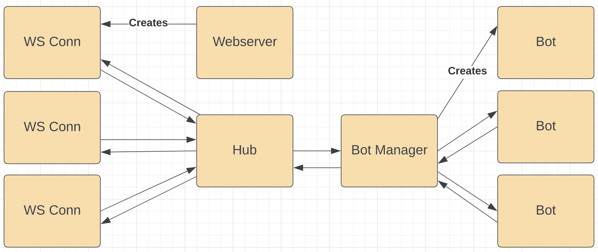

# Figgie - Trading Simulator Game

This is an unofficial implementation of Figgie, a fast-paced trading simulator game invented by [Jane Street](https://janestreet.com).

## Developing locally

To develop locally, you need two terminals.  

In the first, run `scripts/start-backend.sh` to start the backend server. 

In the second, `cd frontend && yarn start` to start webpack dev server.

Webpack dev server will open app on `http://localhost:3000`

## Deploying

Run `scripts/build.sh` to build the binary.

The binary is completely self contained so there is no need for docker or nginx (it has static files embedded and uses certmagic).

I use systemd to run the server on an instance.

## Architecture

The state of all rooms is centralized in the Hub. Each Bot runs in its own goroutine and sends actions to/receives events from the Bot Manager.

## AI

The bot AI is an implementation of the "fundamentalist" from https://arxiv.org/pdf/2110.00879.pdf.  The fundamentalist is very simplistic and only takes observed card counts into account to estimate the probability of each of the 12 possible decks and expected values of each suit.
