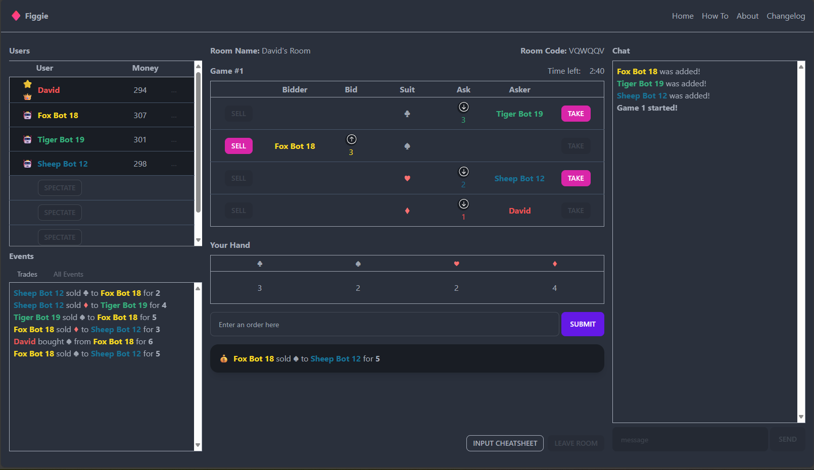

# Figgie - Trading Simulator Game

This is an unofficial implementation of Figgie, a fast-paced trading simulator game invented by [Jane Street](https://janestreet.com).

**Learn more about Figgie:** [Rules](https://www.figgie.com/how-to-play.html) | [Play the official version](https://www.figgie.com/)

## Features
- Real-time multiplayer chat and trading
- Public and private rooms with host, players and spectators
- Bot players with AI strategies
- Hotkeys for fast order entry
- Self-contained deployment (no Docker needed)

## Prerequisites
- Go 1.17+
- Node.js and Yarn

## Running locally
1. Install dependencies: `yarn install` (in both root and frontend)
2. Start backend: `./scripts/start-backend.sh`
3. Start frontend: `cd frontend && yarn start`
4. Open http://localhost:3000

## Deploying

1. Build server binary: `scripts/build.sh`
2. Copy the binary to your server and run directly (defaults to port 8080)

The binary includes:
- Embedded frontend assets
- Builtin HTTPS with automatic certificate management (CertMagic)
- No external dependencies

I use systemd to manage the server in production.

## AI

The bot AI is an implementation of the "fundamentalist" from https://arxiv.org/pdf/2110.00879.pdf.  The fundamentalist only takes observed card counts into account to estimate the probability of each of the 12 possible decks and expected values of each suit.  Future improvements could take into account trade information to estimate these values or estimate player hands.